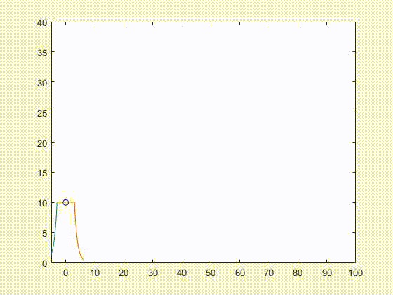

# Volcano Simulation on Matlab

### Demo

This repository contains a `reto_volcan.m` MATLAB script that 
simulates a volcano with three lava rocks coming off it. It takes into account
variable air resistance based on altitude and a changing angle and variable
speed. 

`Reto Volcan 13-10-2022.mlx` corresponds to an old version of the code with
some plotting involved.

# Presentation Requirements

- Introducción
- Tiro parabólico
	- con fricción
	- sin fricción
- Ecuaciones
- Resultados
- Análisis de Resultados
- Conclusiones
- Bibliografía 
